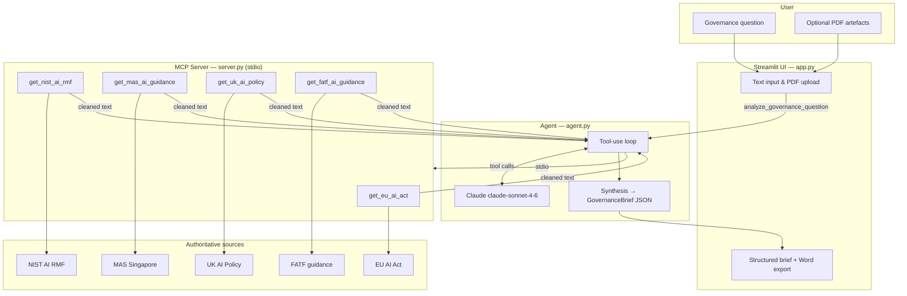

# AI Governance Navigator

An agentic compliance research tool that answers AI governance questions by querying authoritative regulatory sources across multiple jurisdictions, then synthesizing a structured governance brief.

## What it does

Given a governance question (optionally with uploaded internal PDF artefacts such as an AI policy or model card), the navigator:

1. Connects to a local MCP server over stdio
2. Uses Claude (`claude-sonnet-4-6`) with tool use to decide which regulatory frameworks to query
3. Fetches and cleans text from official sources
4. Returns a structured **GovernanceBrief** with findings, convergences, divergences, risk classification, and sources

## Architecture



## Components

| File | Role |
|------|------|
| `server.py` | FastMCP server exposing 5 regulatory research tools over stdio |
| `agent.py` | Agentic loop: MCP tool discovery, Claude tool use, brief synthesis |
| `app.py` | Streamlit web UI with PDF upload and Word export |
| `test_agent.py` | Pytest suite for pure helper functions |

### Regulatory tools

| Tool | Framework | Source |
|------|-----------|--------|
| `get_eu_ai_act` | EU AI Act | [artificialintelligenceact.eu](https://artificialintelligenceact.eu/the-act/) |
| `get_nist_ai_rmf` | NIST AI RMF | [airc.nist.gov](https://airc.nist.gov/Docs/1) |
| `get_mas_ai_guidance` | MAS (Singapore) | [mas.gov.sg](https://www.mas.gov.sg/regulation/explainers/ai-in-financial-services) |
| `get_uk_ai_policy` | UK AI Policy | [gov.uk white paper](https://www.gov.uk/government/publications/ai-regulation-a-pro-innovation-approach/white-paper) |
| `get_fatf_ai_guidance` | FATF | [fatf-gafi.org](https://www.fatf-gafi.org/en/publications/Digitaltransformation/Guidance-AI-in-financial-crime.html) |

### GovernanceBrief output

```json
{
  "question": "...",
  "jurisdictions_consulted": ["EU AI Act", "MAS"],
  "key_findings": { "EU AI Act": ["..."], "MAS": ["..."] },
  "convergences": ["..."],
  "divergences": ["..."],
  "risk_classification": "High | Medium | Low",
  "sources": ["..."]
}
```

## Setup

### 1. Clone and install

```bash
git clone https://github.com/nakulshukla21-dev/ai-governance-navigator.git
cd ai-governance-navigator
python -m venv .venv

# Windows
.venv\Scripts\activate
pip install -r requirements.txt

# macOS / Linux
source .venv/bin/activate
pip install -r requirements.txt
```

For local development and tests:

```bash
pip install -r requirements-dev.txt
```

### 2. Configure environment

Create a `.env` file in the project root:

```env
ANTHROPIC_API_KEY=your-key-here
```

## Usage

### Streamlit web UI (recommended)

**Local** — runs on port 8502 to avoid clashing with other Streamlit apps:

```powershell
# Windows
.\run_app.ps1
```

```bash
# macOS / Linux
streamlit run app.py
```

Open the URL shown in the terminal (default local port is 8501 unless overridden).

**Streamlit Cloud** — deploy from this repo with main module `app.py`. Add secrets in the dashboard:

```toml
ANTHROPIC_API_KEY = "your-key-here"
```

### CLI

```bash
python agent.py --pretty "What are the requirements for high-risk AI systems in the EU?"
```

### MCP server only

The MCP server speaks JSON-RPC over stdio — do not type plain text into its terminal. It is started automatically by `agent.py` / `app.py`:

```bash
python server.py
```

## Tests

```bash
pytest test_agent.py -v
```

## Project structure

```
ai-governance-navigator/
├── agent.py              # Agentic loop + GovernanceBrief
├── app.py                # Streamlit UI
├── server.py             # MCP regulatory tools server
├── test_agent.py         # Pytest suite
├── requirements.txt      # Runtime dependencies
├── requirements-dev.txt  # Dev dependencies (pytest)
├── run_app.ps1           # Local launcher (port 8502)
├── run_app.bat           # Local launcher (port 8502)
└── .streamlit/
    └── config.toml       # Theme (no custom port — Cloud uses 8501)
```

## Notes

- Do **not** use `pip freeze` for `requirements.txt` on Windows — it pulls in OS-specific packages like `pywin32` that break Linux/Streamlit Cloud deploys.
- The agent spawns `server.py` as a subprocess; both must live in the same directory.
- Regulatory content is fetched live from public URLs; results depend on source availability.

## License

MIT (or specify your license here)
